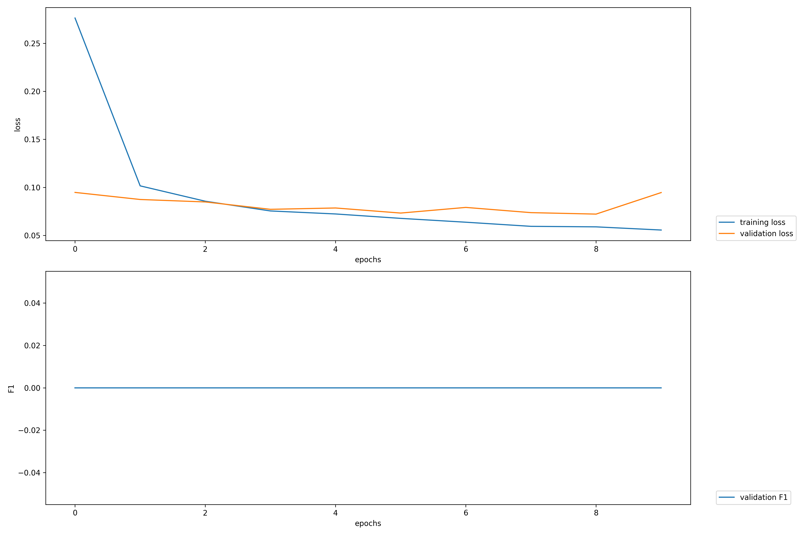

# NLP Models and Training

This activity covers gives a glimpse of what it’s like to be an NLP-focused software developer in industry. 


## Parts

- Use a sentimental analysis from the internet
- Use a basic, pretrained NER model and train it with a given dataset
- Use 2 different translation models and compare its bleu score
## Deployment

The pip and python commands depend on your installation. This should work with python 3.7+. \
\
To deploy this project run:  

```bash
  pip install -r requirements.txt && python run.py
```

\
To run the tests you need to run:

```bash
  python -m unittest test_part3.py
```

```bash
  python -m unittest test_part1.py
```

## Screenshots

This is graph of train set error and test set error rate during training with the full dataset.


